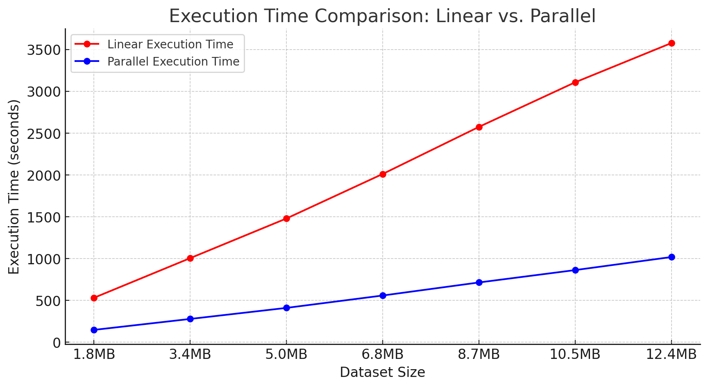

# Context-Aware Text Summarization Using NLP

## Overview

This repository contains Python code designed to evaluate the performance differences between serial and parallel processing approaches in the context of NLP-driven data summarization. The project focuses on summarizing large datasets by extracting contextually relevant sentences based on specified keywords and then generating summaries using Google's generative AI model, Gemini.

## Purpose

The main objective of this project is to compare the efficiency of serial versus parallel processing methods when handling large volumes of text data. We apply these methods to the task of context-aware text summarization, which involves:
- Filtering sentences from a large dataset that are contextually relevant to predefined keywords.
- Summarizing the filtered content to produce concise descriptions.

By implementing both serial and parallel processing approaches, we aim to identify the most effective method in terms of speed and computational resource utilization, providing clear insights into the scalability of NLP tasks.

## Program Description

The program operates under the following steps:
1. **Data Processing**: Sentences are extracted from a CSV file and filtered based on their relevance to a set of keywords using SpaCy's NLP capabilities.
2. **Content Generation**: Filtered sentences are then passed to Google's generative AI model, Gemini, to generate summaries. This is where the distinction between serial and parallel processing becomes crucial.

The repository is organized into four main components:
- `DataProcessor.py`: Manages the reading and filtering of sentences from CSV files.
- `ContentGenerator.py`: Handles interactions with Google's Gemini AI model to generate text.
- `SerialMain.py`: Implements the serial processing workflow.
- `ParallelMain.py`: Implements the parallel processing workflow using Python's multiprocessing capabilities.

## Findings

Through our experiments, we measured the time efficiency of processing data using both serial and parallel methods. The results are visualized in the graph below, illustrating the significant time savings achieved through parallel processing, especially as the dataset size increases.

The graph clearly shows that parallel processing consistently outperforms serial processing, processing data in significantly less time across all tested dataset sizes.